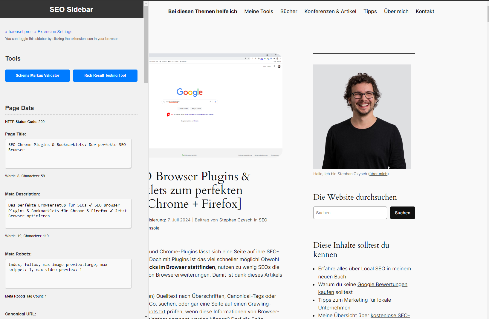
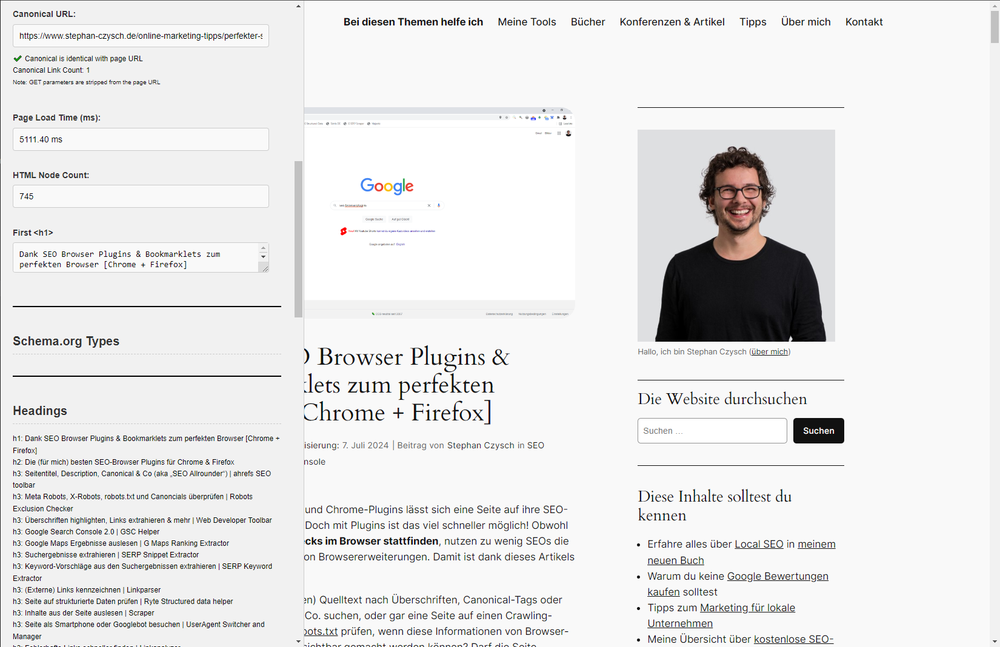
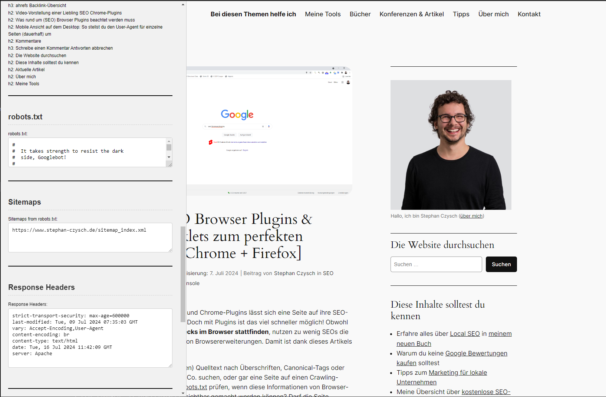
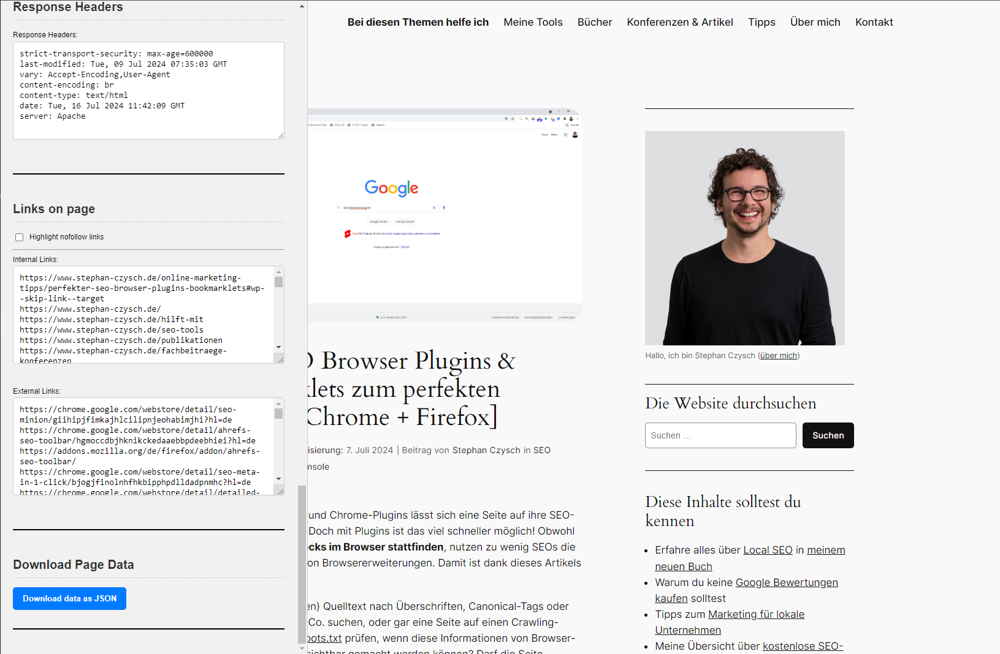

# Persistent SEO Sidebar (Chrome Extension)

## Overview

The SEO Sidebar Chrome Extension adds a sidebar to the browser that remains open across different tabs and sessions. The sidebar provides SEO tools, displays page data, schema.org types, and response headers for the main document. The extension also includes quick access links to validate schema markup and test rich results in Google.

## Features

- Persistent sidebar that remains open across tabs and browser sessions
- Displays page title, meta description, meta robots, canonical URL, page load time, HTML node count, and first H1 tag
- Lists schema.org types used on the page
- Displays a nested list of all headings (`<h1>` to `<h6>`) used on the page
- Shows response headers for the main document
- Quick access links to validate schema markup and test rich results in Google

## Installation

### Get it from the Chrome webstore: 
https://chromewebstore.google.com/detail/persistent-seo-sidebar/hodblncbcllndkgacdoibhopgocikhbl?hl=de

#### Or use the ZIP (not recommended)

1. Clone the repository or download the zip file.
2. Open Chrome and navigate to `chrome://extensions/`.
3. Enable "Developer mode" using the toggle in the top right corner.
4. Click "Load unpacked" and select the folder containing the extension files.

## Usage

1. Once the extension is loaded, click the extension icon to toggle the sidebar.
2. The sidebar will appear on the left side of the browser window.
3. Use the provided tools and links within the sidebar.

## Screenshots
Here are some screenshots so you cen see what it looks like. They might be a bit out of date - I tend to forget stuff like this.

### Quick sample video

<video width="600" controls>
  <source src="screenshots/seosidebar_1.4_video.mp4" type="video/mp4">
  Your browser does not support the video tag.
</video>

By the way: I hope Stephan Czysch is okay with me using his website for my screenshots. I love his list of [SEO Browser Plugins and Bookmarklets](https://www.stephan-czysch.de/online-marketing-tipps/perfekter-seo-browser-plugins-bookmarklets). Go and check them out ❤️.

## Contact
You can reach me at aviationcoder@googlemail.com. 
(also my PayPal \*cough\*)

## Planned features
- collect hreflang links

## Completed Features
- ✔️ Word count of title, meta description etc.
- ✔️ Character count of title, meta description etc.
- ✔️ Collection of internal and external links on the page.
- ✔️ Export of data to JSON ~~and CSV~~.
- ✔️ Display robots.txt content.
- ✔️ Function to check current URL against robots.txt using a selection of common UserAgents.
- ✔️ Option to highlight nofollow links

## Important fixes and changes
- Sidebar doesn't interfere with page margin anymore. 
  The sidebar will overlay the content and can be shown or hidden usinng the extension icon.
- The script now shows the count of canonical URLs and meta robots tags.
- Cleaned up the tool buttons so they don't take up as much space.
- Sometimes I've had the issue that the HTTP response code and response headers were not loaded. This _should_ be fixed - but if it happens to you, simply reload the page.
- Fixed robots.txt checker - there was a bug so it wouldn't work with consecutive useragent directives.
