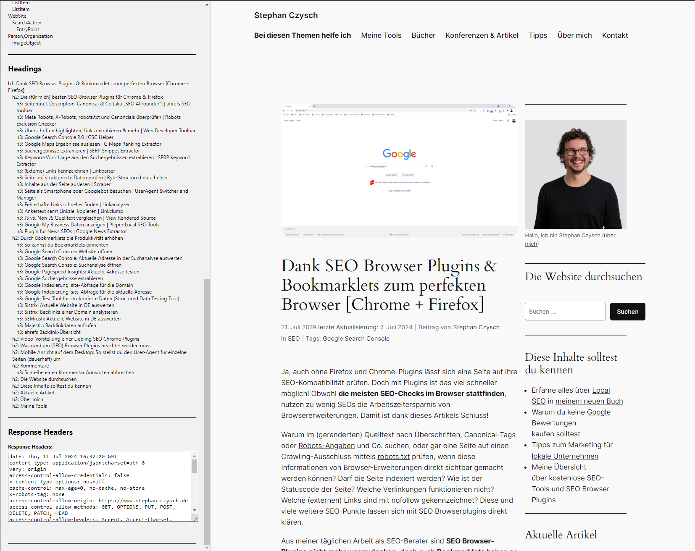

# Persistent SEO Sidebar (Chrome Extension)

## Overview

The SEO Sidebar Chrome Extension adds a sidebar to the browser that remains open across different tabs and sessions. The sidebar provides SEO tools, displays page data, schema.org types, and response headers for the main document. The extension also includes quick access links to validate schema markup and test rich results in Google.

## Features

- Persistent sidebar that remains open across tabs and browser sessions
- Displays page title, meta description, meta robots, canonical URL, page load time, HTML node count, and first H1 tag
- Lists schema.org types used on the page
- Displays a nested list of all headings (`<h1>` to `<h6>`) used on the page
- Shows response headers for the main document
- Quick access links to validate schema markup and test rich results in Google

## Installation

1. Clone the repository or download the zip file.
2. Open Chrome and navigate to `chrome://extensions/`.
3. Enable "Developer mode" using the toggle in the top right corner.
4. Click "Load unpacked" and select the folder containing the extension files.

## Usage

1. Once the extension is loaded, click the extension icon to toggle the sidebar.
2. The sidebar will appear on the left side of the browser window.
3. Use the provided tools and links within the sidebar.

## Screenshots

The top part

The lower part

## Contact
You can reach me at aviationcoder@gmail.com.

## Planned features
- Word count of title, meta description etc.
- Character count of title, meta description etc.
- Collection of internal and external links on the page
- Export of data to JSON and CSV
